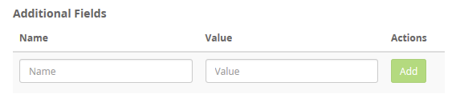
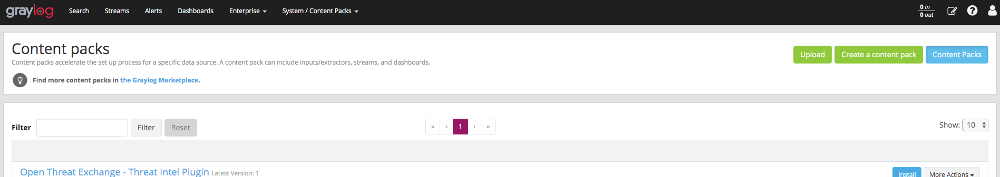
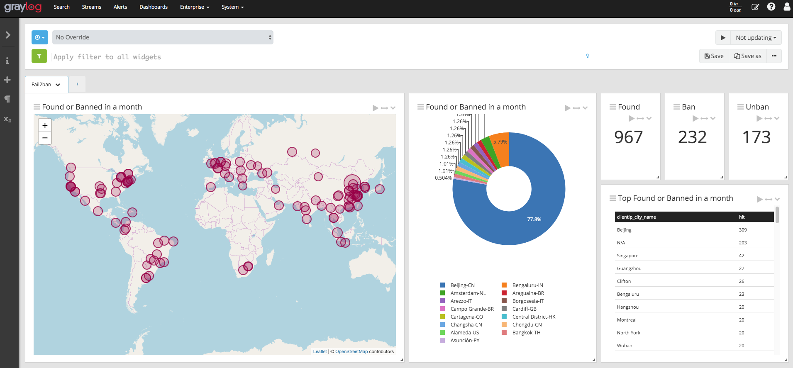

# Fail2ban Actions content pack for Graylog

[](https://choosealicense.com/licenses/mit/)

This content pack install a *pipeline* (with pipeline rules) and a *grok* pattern.  
This *pipeline* parse **fail2ban** log received with a GROK pattern to create *fields* such as *clientip* to use with [Graylog Geolocation](http://docs.graylog.org/en/3.2/pages/geolocation.html).

## Example message

```text
2020-03-27 20:16:27,162 fail2ban.actions  [2667]: NOTICE [sshd] Ban 1.1.1.1
```

## Fields

```text
f2b_timestamp: 2018-02-09 10:05:21,431
action: Ban
clientip: 1.1.1.1
digit: 2667
log_level: NOTICE
method: actions
service: sshd
src_app: fail2ban
```

## Input

I personally use *filebeat* to collect logs.  
To better filter logs this *pipeline rule* search for specific additional field called **log_application** with the value of **fail2ban**.

You can customize this *field* as you want editing *content-pack.json*

```json
"source": {
	"@type": "string",
	"@value": "rule \"Is Fail2ban\"\nwhen\n has_field(\"log_application\") and to_string($message.log_application) == \"fail2ban\"\nthen\nend"
}
```

You can add additional custom fields directly from Graylog Beats Input Configuration

[](.img/gl2beats.png)

## Installation

Go to **Graylog Admin Interface** -> **System** -> **Content Packs** then click **Upload** button and select *content-pack.json* file.

[](.img/gl2cp.png)

## Geolocation

Follow the instructions to enable [Graylog Geolocation](http://docs.graylog.org/en/3.2/pages/geolocation.html) and you will be able to create your *dashboard*.

[](.img/gl2dash.png)

## Contributors

GROK pattern was inspired from https://github.com/kurobeats/Fail2ban-GROK-Log-Pattern/blob/master/27-fail2ban_log.conf

## License

This project is licensed under the **MIT** License.  
See [LICENSE.md](LICENSE.md) for details.
